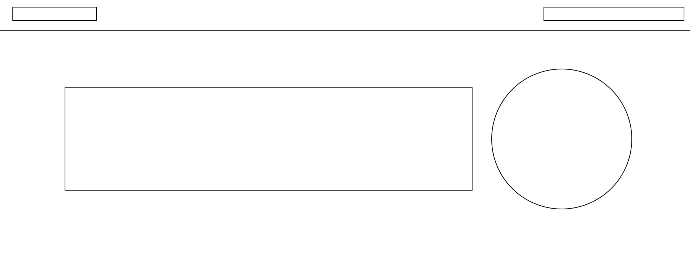
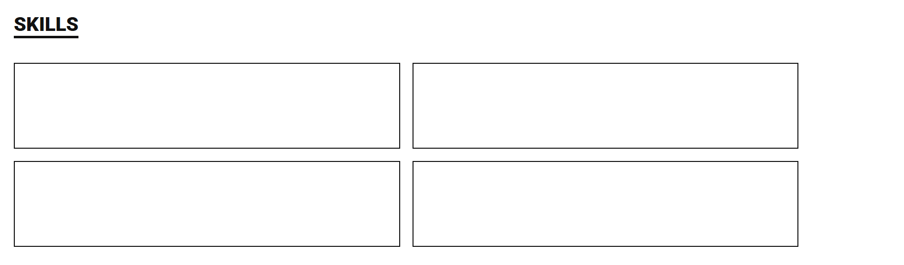
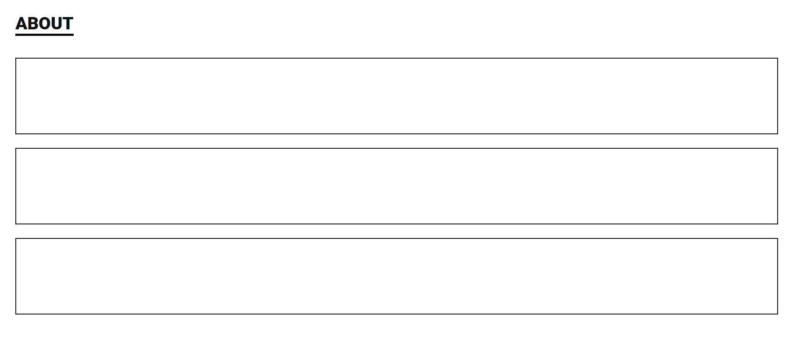
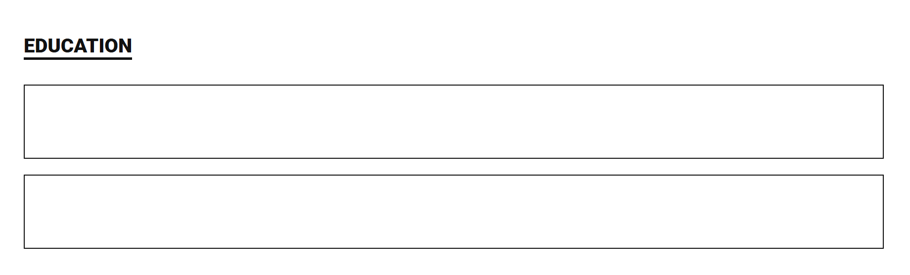
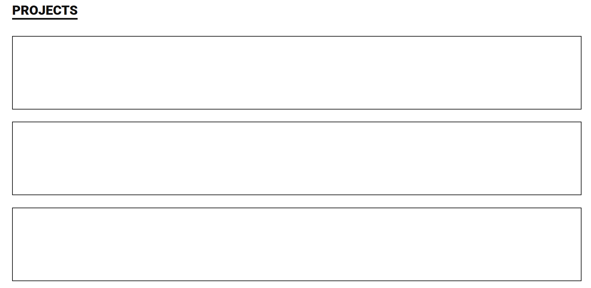
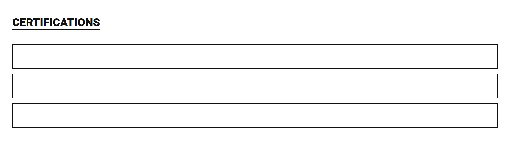
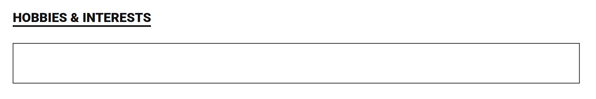
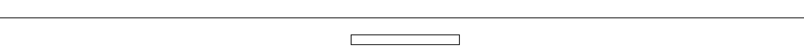

# Portfolio Website

---

# Version 1 – Portfolio Structure (HTML & CSS)

### Main Head

### Skills

### About

### Education

### Projects

### Certificates

### Interests

### Footer

     

---

# **Version 2 – Portfolio Static Website HTML & CSS Styling and Designing Implementation**

### Main Header

### About Section

### Skills Section

### Education Section

### Projects Section

### Certificates Section

### Hobbies & Interests Section

### Footer

   
)
