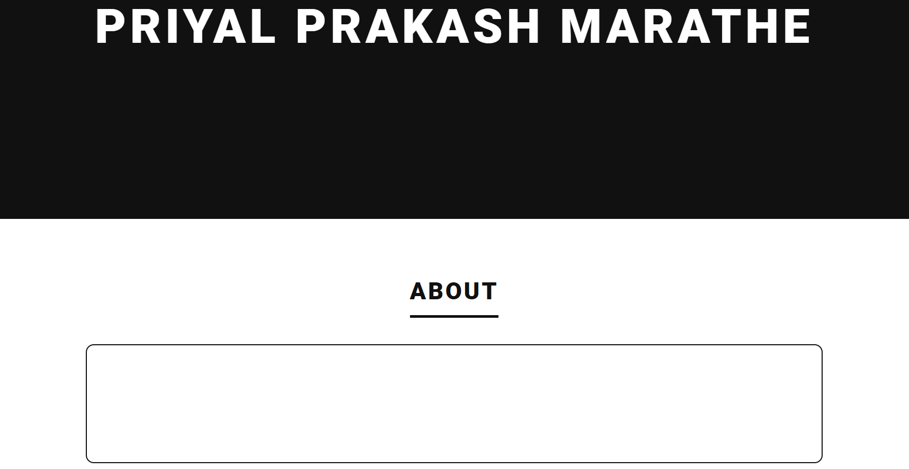
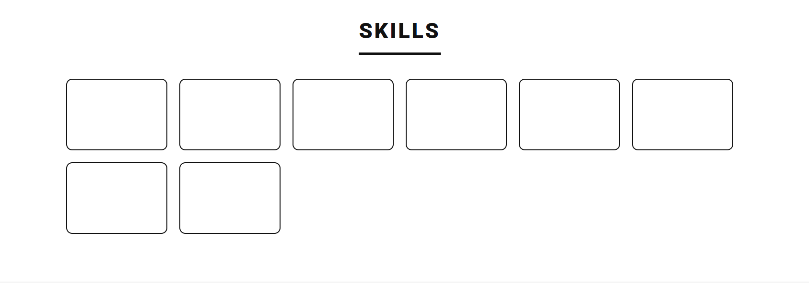
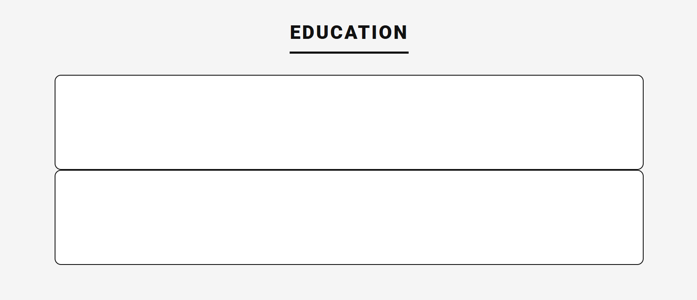
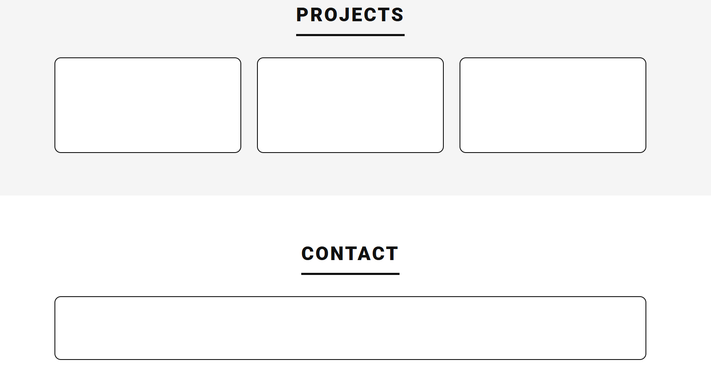
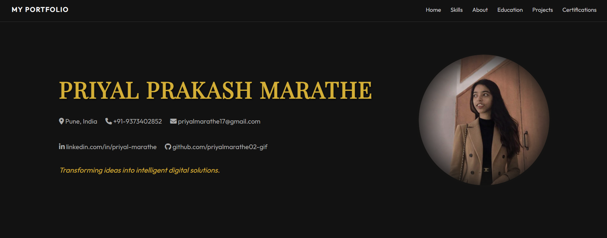
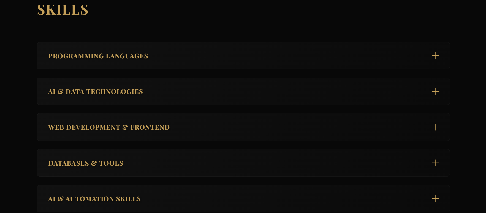
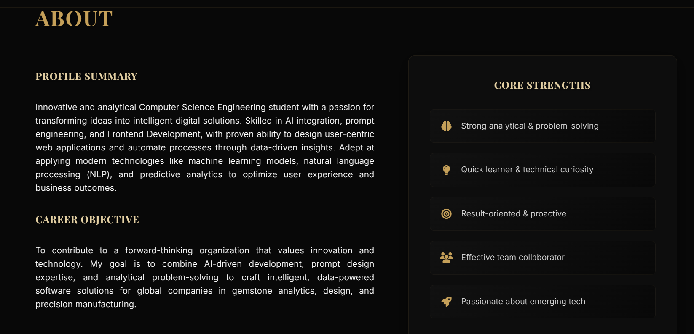
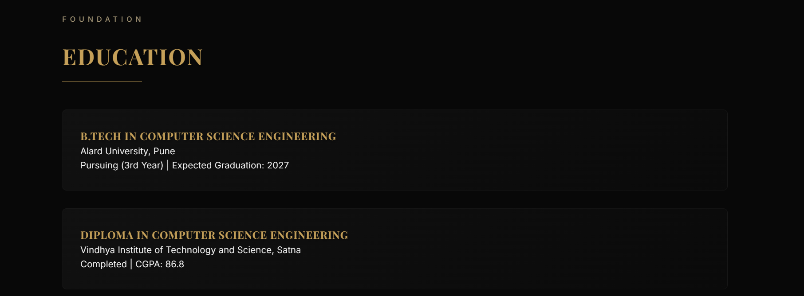
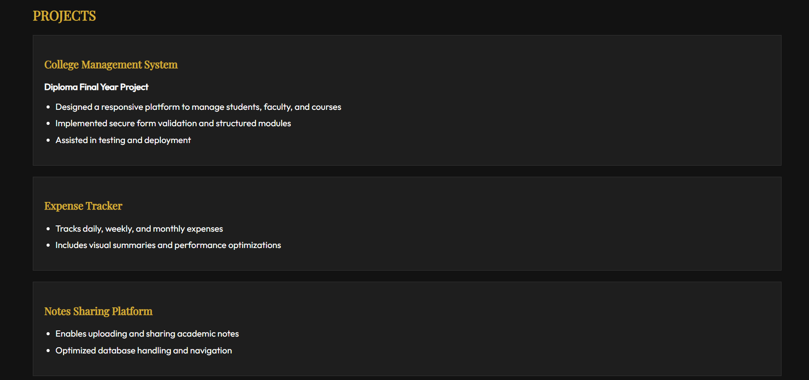
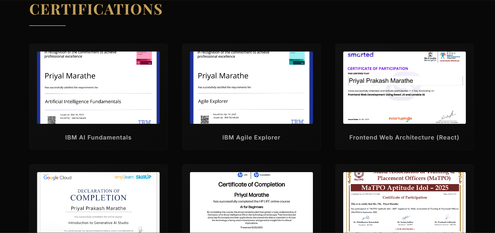

## Version 1 – Portfolio Structure (HTML & CSS)

### Main Section Layout

### Skills Section Layout

### Education Section Layout

### Projects and Contacts Section Layout

### Footer Section Layout

# Portfolio Website (Version 2) HTML & CSS Styling and Designing Implementation
  

## Main Head

## Skills

## About

## Education

## Projects

## Certificates

## Interests

## Footer

